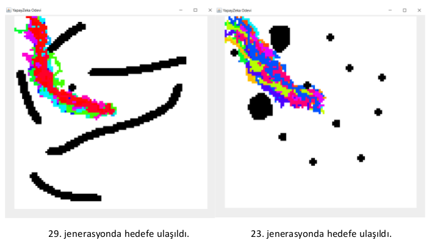
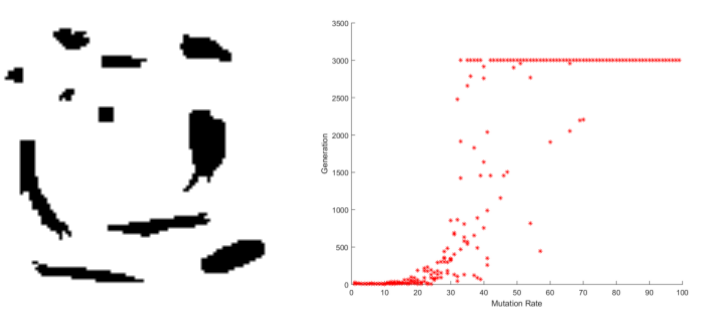
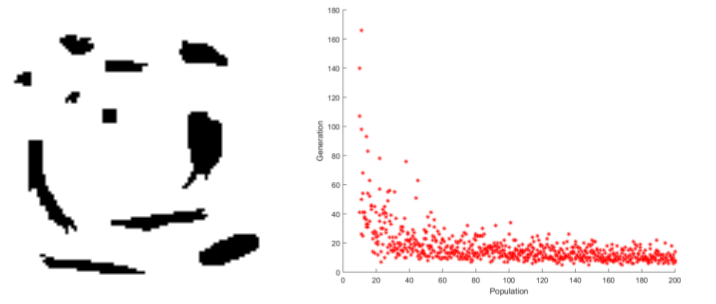
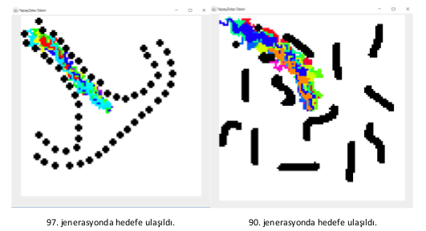
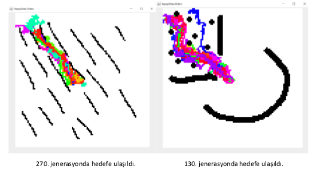
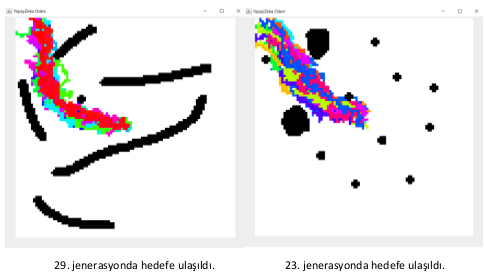
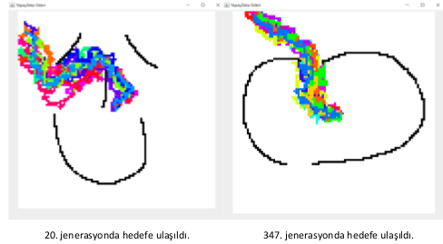
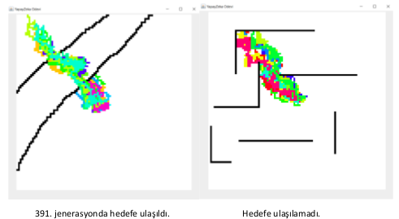

# Path Planning with Genetic Algorithm

**Date: November 2017**

   * [Genetic Algorithm Path Planning](#genetic-algorithm-path-planning)
      * [Introduction](#introduction)
         * [Genetic Algorithm](#genetic-algorithm)
         * [Path Planning](#path-planning)
      * [How To Run](#how-to-run)
      * [Parameters](#parameters)
      * [How It Works](#how-it-works)
      * [Implementation Details](#implementation-details)
      * [Result](#result)
      * [Challenges](#challenges)
      * [Other Results](#other-results)
      * [References](#references)

## Introduction

This project includes two main topics: Genetic algorithm and path planning. These topics are described on other headings. Examining these topics before continuing reading is recommended.

Assume that we have a mouse on centered of an image and the mice needs a food. We put the food on the upper left side of the world. World also include some obstacles. What our purposes are to see whether mices can find the path of the food and on which generation they can achieve.  

We test them using genetic algorithm technique. We define some  parameters comprises of DNA length, population, selection rate and  mutuation rate of mice as well number of itearation. In each iteration best mices are selected, populated and mutuated.

For example the following image is the one output of the algorithm. A color means a mice.



### Genetic Algorithm

A genetic algorithm is a search heuristic that is inspired by Charles Darwin’s theory of natural evolution. This algorithm reflects the process of natural selection where the fittest individuals are selected for reproduction in order to produce offspring of the next generation.

Five phases are considered in a genetic algorithm:

1. Initial population
2. Fitness function
3. Selection
4. Crossover
5. Mutation

For more explanation about genetic algorithms, you can follow this [website](https://towardsdatascience.com/introduction-to-genetic-algorithms-including-example-code-e396e98d8bf3)

### Path Planning

A path plannig algorithm finds optimal path between two positions on a map. These algorithms are used in robotics, logistics and navigation systems. There are different methods:

1. Djkstra
2. A-Star
3. RRT (Rapidly-exploring random tree)
4. Depth first search
5. Breadth first search

For more explanation about genetic algorithms, you can follow this [website](http://correll.cs.colorado.edu/?p=965)


## How To Run

Java Runtime required to run this project. For Windows and Linux users there are scripts in `bin` folder. Parameters can be modified in these files. Generated images for each epoch will be located in `bin/generated_images` folder.

```bash
$ bash bin/start.sh
```


## Parameters

- **WORLDFILE** (default = "world.png")
  - Bitmap file path will be used as a world. Black pixels are occupied, white pixels are considered free space.

- **POPULATION** (default = 100)
  - Mice count in each generation.
- **LENGTHOFDNA**  (default = 300)
  - DNA includes movement of mice. If this value is higher, mices' path will be longer.
- **SELECTIONRATE** (default = 0.30)
  - The best mices will be selected at this rate.
- **MUTATIONRATE** (default = 0.005)
  - Probability of random modification in mices' DNA.
- **THREADSLEEP** (default = 20)
  - Waiting time between generations to visualize window. (in miliseconds)
- **DISTANCEMETHOD** (default = 1)
  - Distance evaluation function. 1 for euclidian distance, 2 for manhattan distance.


## How It Works

For every generation these steps are repeated:

1. DNA includes four different pieces: `L`eft, `U`p, `R`ight, `D`own. Mice navigates according to it's DNA. 

   - Example: {U, U, R, R, D} -> This mice will go up twice then go right twice then go down.
2. Mice fitnesses are calculated based on proximity to goal point.
3. Best mices (according to fitness) are selected, others will be deleted.
4. New mices generated with crossing-over best mices' DNA.
5. Mutation applied to all mices.


## Implementation Details

- **Mice** (Class)
  - DNA wrapper.
- **Genetic** (Class)
  - Genetic algorithm implementation; selection, crossover, mutation, fitness.
- **World** (Class)
  - GUI and image reader.
- **Main** (Class)
  - Main function and parameter parsing.


## Result

As a result, most of the path planning tasks completed successfully. But some tasks show the failure of generation because of the maze like worlds. In those worlds genetic path planning algorithm was not able to find the correct route because it prefers the shortest path.

Test map (left) and chart of `Generation Reached the Target` according to `Mutation Rate` (right):



Test map (left) and chart of `Generation Reached the Target` according to `Population` (right):



## Challenges

- **How fitness is calculated?**
  - Distance calculation such as Euclidean or Manhattan is preferred in order to measure fitness value. Fitness is calculated with distance between the target and and the mice.
  
- **What will happen when mice collides with a obstacle?**
  - Mice will stop it's movement. Fitness calculation will be calculated according to this position.
  
- **How to solve maze like worlds?**
  - There are multiple `Local Maximas` in maze like worlds for genetic algorithms. Solutions may converge to a local maxima. An example try: If mice navigates to a point which was visited before this means that part of DNA neutralizes itself. This can be used in fitness calculation. But this method will only make the path less recurrent and effective. Mice still may be unable to reach the target. See image `bin/exmp7.png` (maze like world example).


## Other Results

- Following parameters are used:
  - Population = 20
  - DNA length = 400
  - Selection Rate = 0.30
  - Mutuation Rate = 0.03











## References

- <https://towardsdatascience.com/introduction-to-genetic-algorithms-including-example-code-e396e98d8bf3?gi=42457d0c83a2>
- <http://correll.cs.colorado.edu/?p=965>
